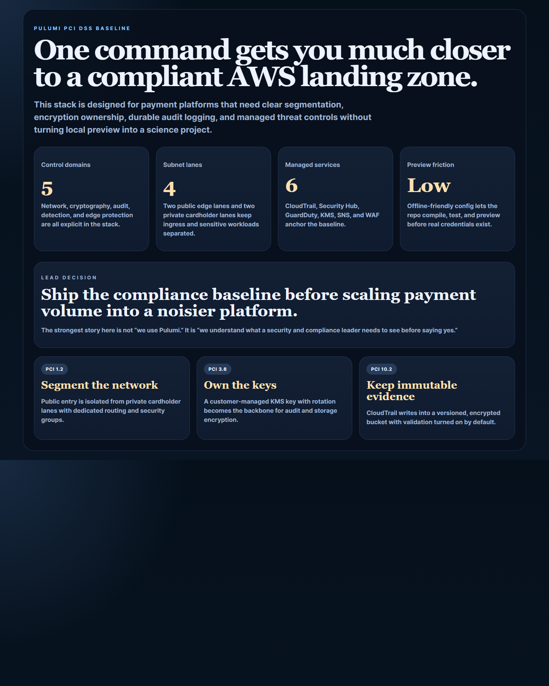
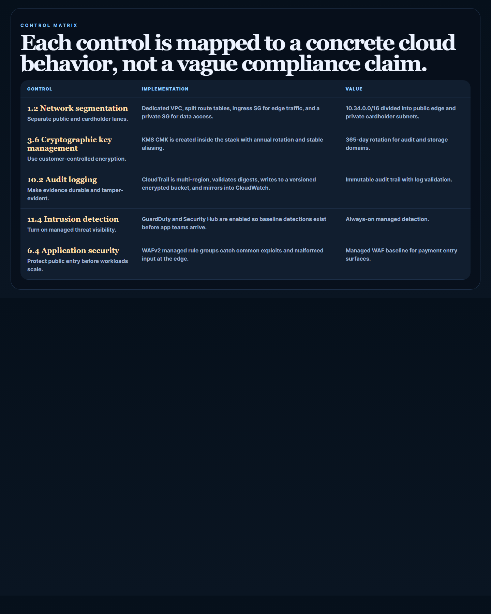
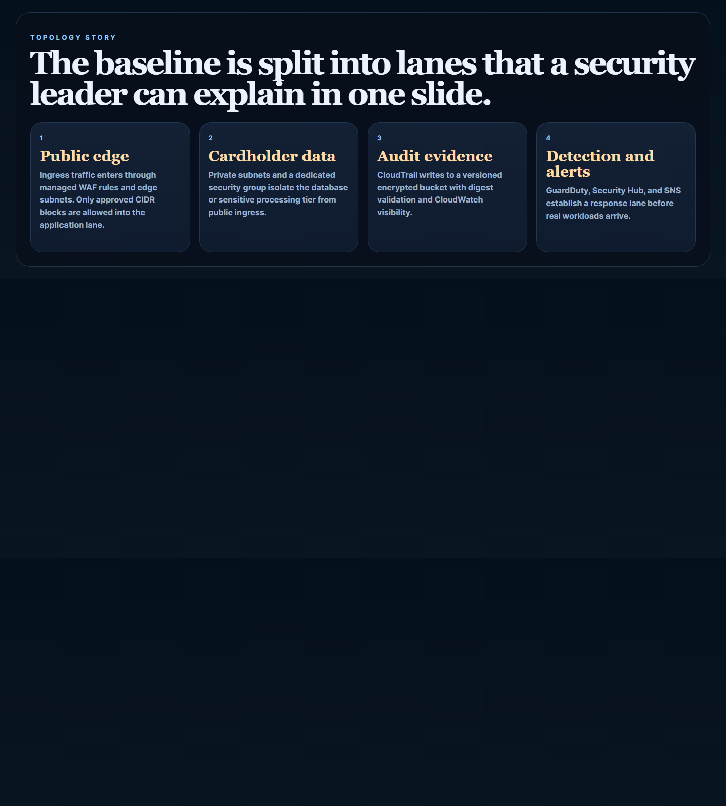
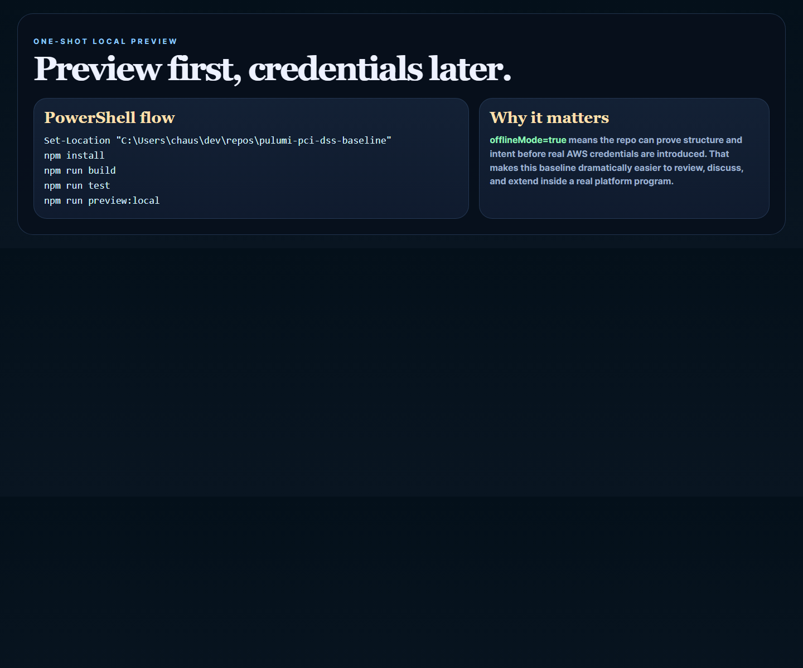

# Pulumi PCI DSS Baseline

Pulumi AWS baseline for PCI-DSS controls, network segmentation, KMS rotation, WAF protection, and immutable audit logging.

## Why this repo is good

- It targets a real enterprise buying center: security, platform, and compliance.
- It gives your portfolio explicit IaC depth, not just application code.
- It tells a serious fintech story alongside `payment-event-ledger-eos`.
- It is local-preview friendly, so the repo is useful even before real AWS credentials enter the picture.

## Screenshots






## What it provisions

- segmented VPC with edge and cardholder subnet tiers
- ingress and data-lane security groups
- KMS CMK with rotation
- CloudTrail with KMS encryption and log validation
- versioned S3 audit bucket
- GuardDuty detector
- Security Hub enablement
- SNS compliance alert topic
- WAFv2 managed rule baseline

## Local validation

```powershell
Set-Location "C:\Users\chaus\dev\repos\pulumi-pci-dss-baseline"
npm install
npm run build
npm run test
```

## Local preview

Pulumi CLI is supported, but the stack is configured for offline-friendly preview first.

```powershell
Set-Location "C:\Users\chaus\dev\repos\pulumi-pci-dss-baseline"
npm install
npm run preview:local
```

That script:

- logs into a local Pulumi backend
- initializes/selects the `dev` stack
- sets baseline config
- runs `pulumi preview` with `offlineMode=true`

## Repo anatomy

- [index.ts](./index.ts)
- [src/config.ts](./src/config.ts)
- [src/plan.ts](./src/plan.ts)
- [src/stack.ts](./src/stack.ts)
- [tests/plan.test.ts](./tests/plan.test.ts)
- [scripts/preview-local.ps1](./scripts/preview-local.ps1)
- [docs/architecture.md](./docs/architecture.md)

## Notes

This repo is designed to be one-shot friendly:

- TypeScript compile and tests work without cloud credentials
- preview mode can run against a local backend
- the AWS controls are explicit and readable

When you do want to point it at a real account, switch `offlineMode` to `false` and supply real AWS credentials.
